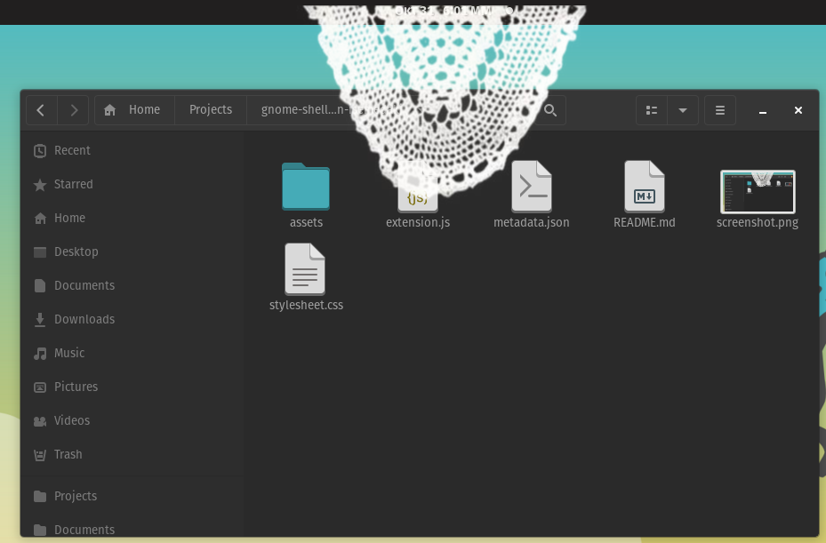

iSemedaki for GNOME Shell
======================

Have you miss mom putting a semedaki on your screen? Now you can have a virtual one.

An essential gnome extension.
-----------------------------------



# Usage

```
$ git clone https://github.com/jtsagata/gnome-shell-extension-isemdaki.git ~/.local/share/gnome-shell/extensions/isemdaki@linuxuser.gr
```

More info and screenshoots: https://linux-user.gr/t/isemedaki-h-epektash-gnome-poy-den-prepei-na-leipei-apo-kanena-ellhniko-spiti/3590
